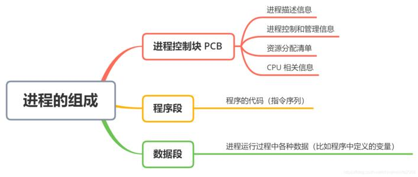
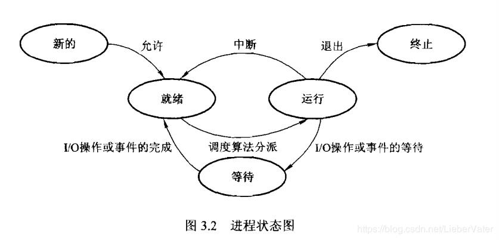
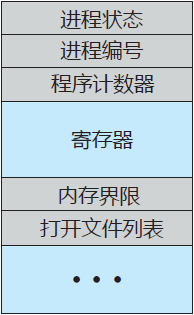

# 操作系统

## 1.进程

#### 1.1 进程概念 

##### 1.1.1 进程概述
`进程是活动实体，具有一个程序计数器用于表示下个执行命令和一组相关资源。
当一个可执行程序被加载到内存，这个程序成为进程。`

##### 1.1.2 进程状态
1. 创建（new）；
2. 运行，执行中；
3. 等待，等待发生某个事件（例如I/O完成或收到信号）；
4. 就绪，进程等待分配处理器；
5. 终止，执行完毕；

##### 1.1.3 进程控制块（PCB）
操作系统的每个进程表示，采用进程控制块，包含如下内容:
* 进程状态：见 **1.1.2**；
* 程序计数器：表示下一个执行指令的地址；
* CPU寄存器：根据计算机体系结构的差异，寄存器类型和数量也会不同，包括累加器、索引寄存器、堆栈指针、通用寄存器和其他条件码信息寄存器，当进程发生中断时，这些信息和程序计数器一起保存，以便之后可以正确运行；
* CPU调度信息：包括进程优先级、调度队列的指针和其他调度参数等，详情见 **3进程调度**；
* 内存管理信息：包括基地址、界限寄存器的值、页表和段表，详情见 **6内存管理策略**，；
* 记账信息：包括CPU时间、实际使用时间、时间期限等；
* I/O状态信息：给进程分配的I/O设备列表，打开文件列表等；

##### 1.1.4 线程
许多现代操作系统扩展了进程概念，以便支持执行多个线程，PCB扩展到包含了每个线程的信息，详情见 **2线程**

#### 1.2 进程调度

##### 1.2.1 调度队列
进程进入系统前会被加入作业队列（job queue，包括了系统内的所有进程），

## 2.线程

## 3.进程调度

## 4.同步

## 5.死锁

## 6.内存管理策略

## 7.虚拟内存管理

## 8.文件系统

## 9.I/O系统

## 10.系统安全